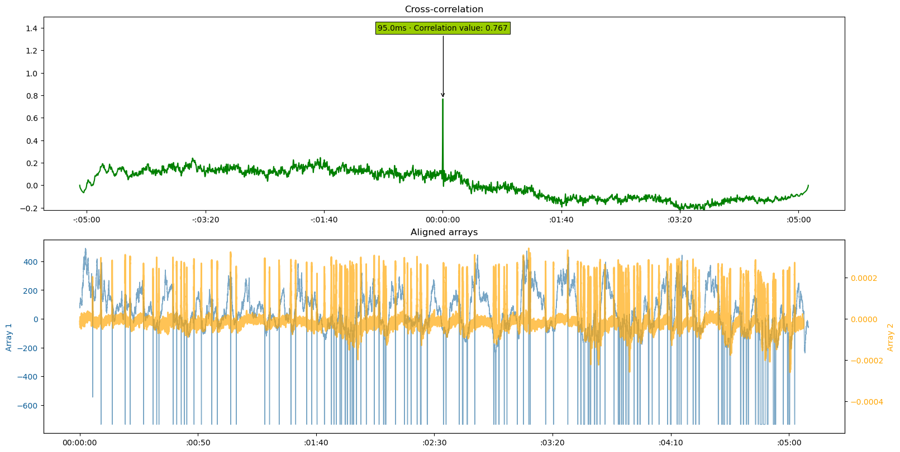

Align eye-tracking data with EOG data
=====================================

Introduction
------------
This package is not limited to comparing two separate audio files. In neuroscientific research, it can also be used to
determine the delay or timing differences between two different signals.

In this example, we use cross-correlation to estimate the delay between an Eye-tracker signal and an EOG
(Electrooculogram) signal, both recorded simultaneously in the MEG (Magnetoencephalography). If you do not have
recorded EOG, you can also use the ICA-component of your MEG or EEG data reflecting the blinks.

Eye-tracker data often contains NaN values during blinks. To address this, you can either interpolate the missing
values or use an alternative signal such as pupil size. In this example, we use the pupil data.

Before beginning the analysis, we recommend visually inspecting the data for both the Eye-tracker and the EOG
channels to ensure quality and identify potential issues. It may also be useful to check whether there were any pauses
in the two recordings. If pauses are present, consider cropping the data to exclude these segments before performing
the cross-correlation.

Code
----

.. code-block:: python

    # EOG-data
    eog_y = meg_data.copy().pick(picks='EOG061').get_data()[0, :]  # Get the vertical EOG where the blinks are most pronounced
    eog_fs = meg_data.info['sfreq']  # Get the sampling frequency of the EOG data

    # Eye-tracker data
    et_p = et_data.copy().pick(picks='pupil_right').get_data()[0, :]  # Get the pupil array
    et_fs = et_data.info['sfreq']  # Get the sampling frequency of the eye tracker data

    delay, corr = find_delay(
        array_1=et_p,
        array_2=eog_y,
        freq_array_1=et_fs,
        freq_array_2=eog_fs,
        resampling_rate="auto",
        plot_figure=True)

The resulting figure:

