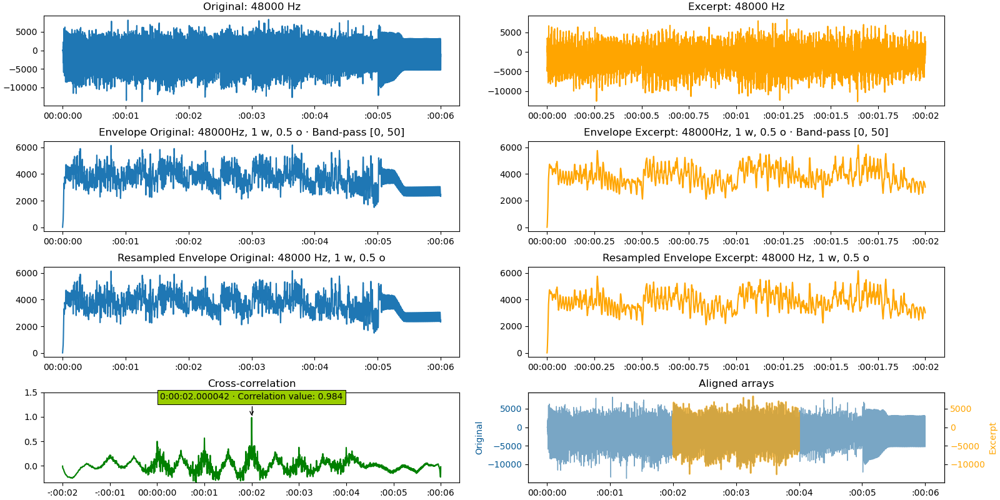

Find the delay between two audio files
======================================
Since version 2.11, it is possible to directly find the delay between audio files by just setting the path
to the audio files as parameters to the find_delay function:

.. code-block:: python

    delay = find_delay("audio_file.wav", "excerpt.wav")

By default, only putting these two parameters will work and return a delay in samples of ``"audio_file.wav"``.

Mono/stereo files
-----------------
If the audio files are in **stereo** (or more channels), the function will automatically run the cross-correlation on
the first channel for both files. This can be manually set via the parameter ``mono_channel``, where it can be set
on an integer (default 0), or on ``"average"`` to average the samples across all channels.

.. code-block:: python

    delay = find_delay("audio_file.wav", "excerpt.wav", mono_channel="average")

This parameter applies to all the audio files - in the case where you want to select different channels between the
audio file and the excerpt, select the channel you need beforehand.

.. code-block:: python

    from scipy import wavfile

    wav_full = wavfile.read("audio_file.wav")
    wav_full_freq = wav_full[0]
    wav_full_array = wav_full[1][:, 0]  # Get the first channel

    wav_excerpt = wavfile.read("audio_file.wav")
    wav_excerpt_freq = wav_excerpt[0]
    wav_excerpt_array = wav_excerpt[1][:, 1]  # Get the second channel

    # As we pass the arrays only, we now need to specify the frequency
    delay = find_delay(wav_full_array, wav_excerpt_array, wav_full_freq, wav_excerpt_freq)

Audio files with different frequencies
--------------------------------------
Audio files with different frequencies need to undergo resampling. The parameters controlling the resampling are
``resampling_rate``, ``window_size_res``, ``overlap_ratio_res``, and ``resampling_mode``.

If ``resampling_rate`` is set on ``"auto"`` (default), the function will automatically try to perform the resampling at
the lowest frequency of the two arrays. For example, with an original file sampled at 48000 Hz and an excerpt sampled
at 44100 Hz, the function will resample the original file at 44100 Hz before calculating the delay. Then, the returned
delay will be converted to return the appropriate sample value at the original sampling of 48000 Hz.

.. code-block:: python

    delay = find_delay("audio_file.wav", "excerpt.wav", resampling_rate="auto")

It is also possible to manually set the resampling rate to a lower value, such as 10000 Hz. Note that the lower the
resampling rate, the lesser accurate the result will be. As the cross-correlation relies on the envelopes of the audio
files, setting a resampling rate to a value lower than 1000 Hz may not allow to detect any correlation.

.. code-block:: python

    delay = find_delay("audio_file.wav", "excerpt.wav", resampling_rate=10000)

In order to reduce the memory load and to accelerate the calculations, the function also offers to cut the large
arrays into windows with overlaps, perform the resampling on these windows, then glue these windows together. The
parameter ``window_size_res`` allows to set the size of the windows, while ``overlap_ratio_res`` sets the overlap.
The default values for these parameters (window size of 1 million samples and overlap of 50 ̀%) allow to significantly
speed up the computation, with a negligible trade-off in accuracy. These parameters should be tweaked cautiously,
and only for very large files.

.. code-block:: python

    delay = find_delay("audio_file.wav", "excerpt.wav",
                       resampling_rate=10000, window_size_res=1e6, overlap_ratio_res=0.5)

Finally, the parameter ``resampling_mode`` defines the numpy or scipy method to resample the data. By default,
the `CubicSpline <https://docs.scipy.org/doc/scipy/reference/generated/scipy.interpolate.CubicSpline.html>`_ method
is selected, but other methods might come relevant for different use-cases.

.. code-block:: python

    delay = find_delay("audio_file.wav", "excerpt.wav",
                       resampling_rate=10000, resampling_mode="cubic")

Compute the envelope for audio files
------------------------------------
It is recommended to calculate the envelope of audio files (parameter ``compute_envelope`` - defaults to ``True``). Two
more parameters, ``window_size_env`` and ``overlap_ratio_env`` allow to cut big audio arrays into windows, in a similar
fashion as for the resampling (see previous paragraph). The default value of these parameters are of 10 million samples
and an overlap of 50% - and, just like for the resampling, these values allow to significantly speed up the computation,
with a negligible trade-off in accuracy.

.. code-block:: python

    delay = find_delay("audio_file.wav", "excerpt.wav",
                       compute_envelope=True, window_size_env=1e7, overlap_ratio_env=0.5)

Finally, it is also recommended to apply a low-pass filter on the audio arrays - ``filter_below`` has a default value
of 50 Hz, which should work fine in most cases. It is possible to refine the filter by defining a lower cut
(``filter_above``, default to ``None``).

Return the delay in seconds
---------------------------
By default, the find_delay function returns the delay in number of samples. It is possible to set the delay
return format using ``return_delay_format``. For example, for files sampled at 48000 Hz and a delay
found at exactly 1 second, the different methods will return the following values:

.. code-block:: python

    delay = find_delay("audio_file.wav", "excerpt.wav", return_delay_format="index")  # Returns 48000
    delay = find_delay("audio_file.wav", "excerpt.wav", return_delay_format="s")  # Returns 1
    delay = find_delay("audio_file.wav", "excerpt.wav", return_delay_format="ms")  # Returns 1000
    delay = find_delay("audio_file.wav", "excerpt.wav", return_delay_format="timedelta")  # Returns datetime.timedelta(seconds=1)

Plot the delay
--------------
find_delay offers a way to visualize the delay calculation. The relevant parameters are ``plot_figure``,
``plot_intermediate_steps``, ``x_format_figure``, ``path_figure``, ``name_array_1``, ``name_array_2``, and
``dark_theme``.

* ``plot_figure`` will define if to show the figure or not.
* ``plot_intermediate_steps`` will define if to show the results of the resampling and the envelope
  calculations (if they were calculated).
* ``x_format_figure`` will define the format of the values on the x-axis (if set on ``"auto"``, the
  format will be controlled by the value of the parameter ``return_delay_format``.
* ``path_figure``, if defined, will define the path where to save the figure.
* ``name_array_1`` and ``name_array_2`` will define the names of the two arrays on the figure.
* ``dark_mode`` defines if the figure should appear in dark theme or not.

.. code-block:: python

    delay = find_delay("audio_file.wav", "excerpt.wav",
                       plot_figure=True, plot_intermediate_steps=True,
                       x_format_figure="time", path_figure="figures/figure.png",
                       name_array_1="Original", name_array_2="Excerpt", dark_mode=False)

The resulting figure:

