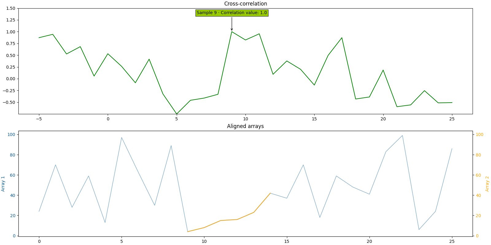
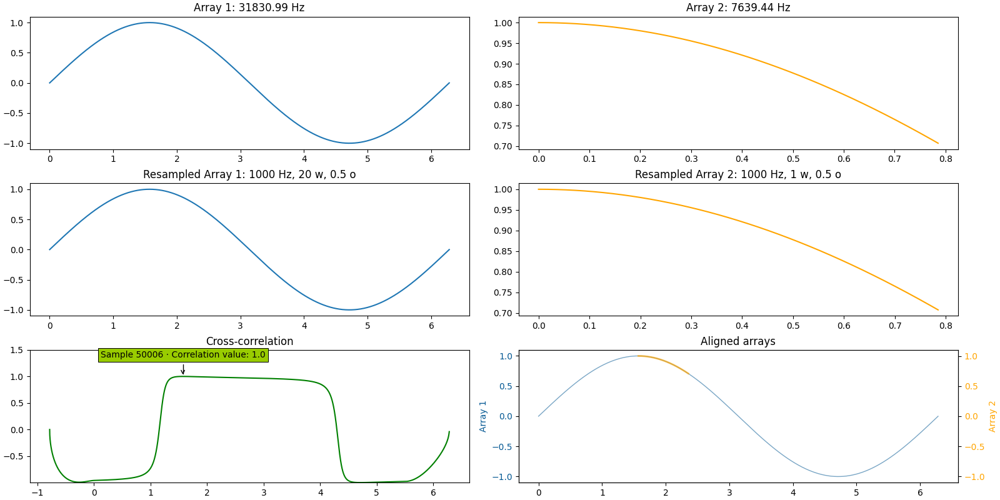

.. find_delay documentation master file, created by
   sphinx-quickstart on Wed May  8 18:21:32 2024.
   You can adapt this file completely to your liking, but it should at least
   contain the root `toctree` directive.

find_delay documentation
========================

What is find_delay?
-------------------
**find_delay** is a **Python package** that tries to find the delay where a time series appear in another via
cross-correlation. It can theoretically work with any time series, but was created to try to align **audio files**.

How do I install find_delay?
----------------------------
You can install find_delay using:

.. tabs::

    .. tab:: Unix/macOS

        .. code-block:: bash

            python3 -m pip install find-delay

    .. tab:: Windows

        .. code-block:: bash

            py -m pip install find-delay

Once it is installed, you can import find_delay into your script via:

.. code-block:: python

   import find_delay

You can then use :doc:`find_delay.find_delay() <find_delay>` or :doc:`find_delay.find_delays() <find_delays>`.

.. important::
   The proper name of the package is ``find_delay``, with an **underscore**. Use it when importing the package in any of
   your projects. However, PIP (the Package Installer for Python) automatically converts underscores to dashes when
   creating packages, to uniformize with other programming languages. Hence, when installing the package in an
   environment, you should run ```pip install find-delay``` (with a dash). Note that calling
   ```pip install find_delay``` (with an underscore) should also work most of the time.

How do I use find_delay?
------------------------
To find when an excerpt starts in an array, use the `find_delay` function and fill only the first five parameters:

   * ``array_1``: An array of numbers or the path to a WAV file
   * ``array_2``: An excerpt of array_1, or the path to a WAV file contained in array_1
   * ``freq_array_1``: The frequency of the array (if it's important, otherwise set it at 1). If array_1 is a path to
     a WAV file, you can ignore this parameter.
   * ``freq_array_2``: The frequency of the excerpt (it it's important, otherwise set it at 1). If array_2 is a path to
     a WAV file, you can ignore this parameter.
   * ``compute_envelope``: If you are trying to find the delay between two audio files, set on `True`, otherwise
     `False`.

Leave the other parameters default (just set ``plot_figure = True`` if you want to visualize the output of the
function). This should be enough for most cases, but you can fine tune other parameters of which you can find the
description :doc:`here <find_delay>`.
If you need to find multiple excerpts into one big array, call :doc:`find_delays <find_delays>` instead.

Examples
--------

Example 1: two arrays of random numbers
^^^^^^^^^^^^^^^^^^^^^^^^^^^^^^^^^^^^^^^

.. code-block:: python

   array_1 = [24, 70, 28, 59, 13, 97, 63, 30, 89, 4, 8, 15, 16, 23, 42, 37, 70, 18, 59, 48, 41, 83, 99, 6, 24, 86]
   array_2 = [4, 8, 15, 16, 23, 42]

   find_delay(array_1, array_2, 1, 1, False, path_figure="figure_1.png")



Example 2: sine function, different frequencies
^^^^^^^^^^^^^^^^^^^^^^^^^^^^^^^^^^^^^^^^^^^^^^^

.. code-block:: python

    timestamps_1 = np.linspace(0, np.pi * 2, 200001)
    array_1 = np.sin(timestamps_1)
    timestamps_2 = np.linspace(np.pi * 0.5, np.pi * 0.75, 6001)
    array_2 = np.sin(timestamps_2)

    find_delay(array_1, array_2, 100000 / np.pi, 6000 / (np.pi / 4),
               compute_envelope=False, resampling_rate=1000, window_size_res=20000, overlap_ratio_res=0.5,
               resampling_mode="cubic", plot_figure=True, path_figure="figure_2.png",
               plot_intermediate_steps=True, verbosity=1)



Example 3: audio files, different frequencies
^^^^^^^^^^^^^^^^^^^^^^^^^^^^^^^^^^^^^^^^^^^^^

.. code-block:: python

    audio_path = "i_have_a_dream_full_speech.wav"
    audio_wav = wavfile.read(audio_path)
    audio_frequency = audio_wav[0]
    audio_array = audio_wav[1][:, 0]  # Turn to mono

    excerpt_path = "i_have_a_dream_excerpt.wav"
    excerpt_wav = wavfile.read(excerpt_path)
    excerpt_frequency = excerpt_wav[0]
    excerpt_array = excerpt_wav[1][:, 0]  # Turn to mono

    find_delay(audio_array, excerpt_array, audio_frequency, excerpt_frequency,
               compute_envelope=True, window_size_env=1e6, overlap_ratio_env=0.5,
               resampling_rate=1000, window_size_res=1e7, overlap_ratio_res=0.5, return_delay_format="timedelta",
               resampling_mode="cubic", plot_figure=True, path_figure="figure_3.png",
               plot_intermediate_steps=True, verbosity=1)

.. image:: ../../demos/figure_3.png

How does it work?
-----------------
The function accepts two arrays containing time series - the time series can be of different frequency or amplitude.
To obtain better results, make sure that the second time series (the excerpt) is entirely contained into the first -
notably, you can trim the second array for it to be the case. The function should work if the second array is over one
of the edges of the first, but the cross-correlation score will never be 1. This implies that, the less amount of the
second array contained in the second, the more likely the chance of getting an erroneous result.

The function can calculate the envelope of the time series (recommended for audio files) and apply a band-pass
filter to the result.

The function can also resample the arrays (necessary when the two time series do not have the same frequency).

Finally, the function performs the cross-correlation between the two arrays.

The results can be then plotted if the corresponding parameters are activated, and the function returns the delay at
which to find the second array in the first by selecting the delay with the maximum correlation value (optionally, the
function can also return this correlation value).

Indices and tables
------------------
.. toctree::
   :maxdepth: 2

   find_delay
   find_delays
   private_functions
   version_history
   faq

* :ref:`genindex`
* :ref:`modindex`
* :ref:`search`
